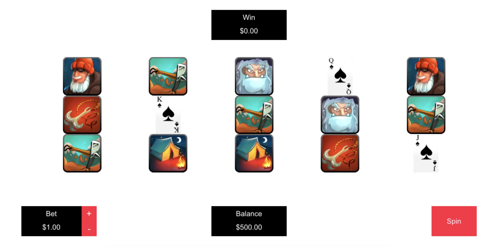
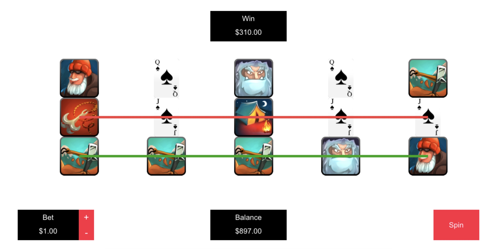

## A simple slots game with some rules

[Live link](https://kennyliuwenjun.github.io/slots-game/)

Framework:
 - PixiJS

Winning pattern:
  

Odds:
- 1 axe: Three Kind = 250, Four Kind = 500, Five Kind = 1000
- 2 hook: Three Kind = 200, Four Kind = 450, Five Kind = 800
- 3 fire: Three Kind = 150, Four Kind = 400, Five Kind = 700
- 4 axe: Three Kind = 100, Four Kind = 350, Five Kind = 600
- 5 axe: Three Kind = 90, Four Kind = 300, Five Kind = 700
- 6 axe: Three Kind = 80, Four Kind = 250, Five Kind = 600
- 7 axe: Three Kind = 70, Four Kind = 200, Five Kind = 500
- 8 axe: Three Kind = 60, Four Kind = 100, Five Kind = 400

## Screenshot
  

